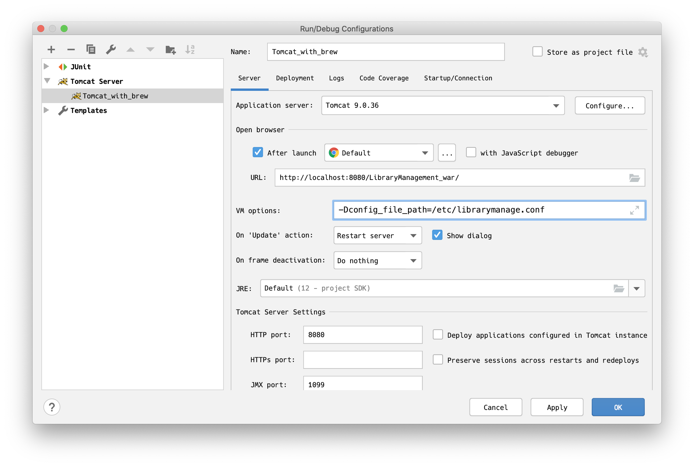

# 図書管理システム
社内の貸出図書を管理するシステム

## 開発環境
* macOS 10.15.5
* IntelliJ IDEA 2020.1.2
* OpenJDK 12.0.2
* Docker version 19.03.8, build afacb8b
* docker-compose version 1.25.5, build 8a1c60f6
* Tomcat 9.0.36 by Homebrew

## 開発環境構築
1. リポジトリのクローン

    `git clone https://github.com/e-matsuy/library_system.git`
1. データベースの起動

    `cd cloned_dir/docker;docker-compose up -d`
1. IntelliJ IDEAの起動

    `cd ..; idea .`
1. Tomcatへのデプロイ設定
    1. Run/Debug configurationを開く<br>
    1. 左上+ボタンをおし、"Tomcat Server"のlocalを選ぶ
    1. application serverのComfigureを押して、TomcatのHome(libexec)のパスを入力してok
    1. 一番下、"before launch"の+を押して"Build Artifacts"をクリック。デフォルトだとwarが2つ出るのでexplodedじゃない方にチェクしてok
    1. apply
    1. Run して デフォルトブラウザが開いてWebページが表示されれば完了
    
1. 環境変数/システムプロパティの設定

    システムは以下の環境変数またはシステムプロパティを参照する
    * config_file_path: 設定ファイルの絶対パス
    1. システムプロパティを設定する(開発環境を想定)
    
        システムの実行の際にVMの起動オプションを設定
        
        `-D<name>=<value>` 形式で設定。-Dの後ろにスペースは不要なので注意。
       
    1. 環境変数に設定(本番環境を想定)
    
        環境によって違うはずなので要チェック。以下はunixのshellの場合。
        ```shell
           $ export name=value
        ```
1. 設定ファイルを配置する
    
    システムの以下のプロパティをファイルに記載し前項で指定した場所に配置する。
    * secret: トークン生成時に署名するためのシークレット
    * jdbc_url: データベースへ接続するためのjbdcurl
    * user_name: データベースへ接続する際のユーザー名
    * password: データベースへ接続する際のパスワード
    
    書式は`java.util.Properties`が扱える形式とする。
    > https://docs.oracle.com/javase/jp/8/docs/api/java/util/Properties.html#load-java.io.Reader-
                                                                                                   
    ```:config
    secret=this_is_secret
    jdbc_url=jdbc://hogheog    
    ```